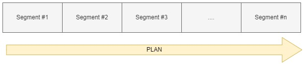
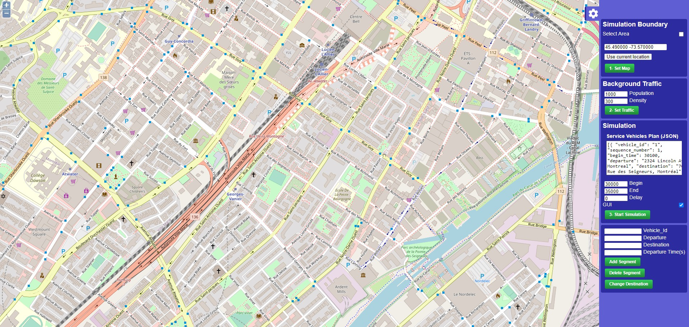
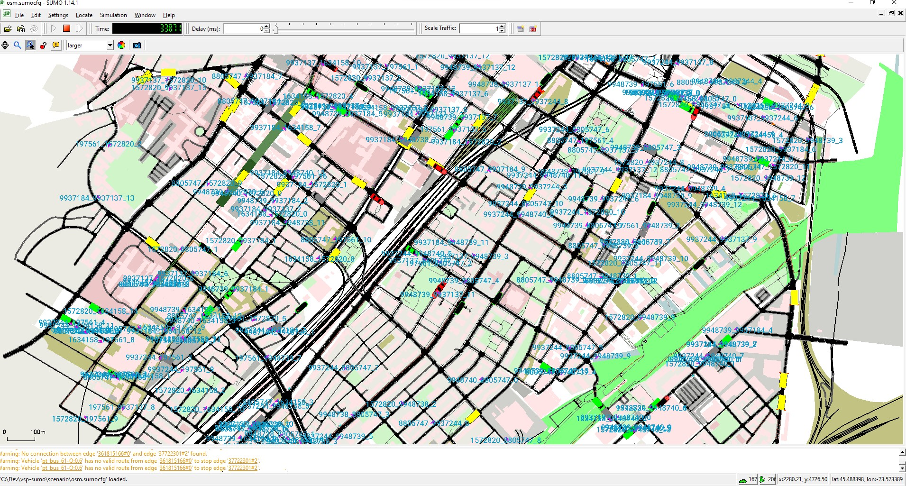

# VSP - Visualization Simulation Platform

The VSP (Visualization Simulation Platform) is an Open-Source application based on the SUMO (Simulation for Urban Mobility). The VSP is specifically designed and implemented for MoD researches and use cases. The VSP provides APIs to easiliy setup an MoD environment and start a simulation. The primary steps are as follows:

1. Set area on the map
2. Set background traffic
3. Set vehicles plan
4. Start simulation
5. Apply on-demand changes (if needed) while simulation is running

### **Motiviation**

In MoD researches there are several limitations and obstacles that might cause the researchers have difficulties to experiment their solutions and ideas. A few of these limitations are as follows:

- Limited or no MoD data available
- Expermenting on real streets and vehicles are time-consuming and very costly
- Experimenting ideas on real roads are not flexible
- Existing simulation platforms are not quite easy to setup and due to their complexities it is very complicated to apply changes
- Existing simulation platforms cannot be integrated to other applications, because they do not offer APIs for connectivity

According to the afforementioned limitations, we wanted to design and implement an open-source application for MoD use cases, so that researcher can easily setup the simulation environment, and experiment his/her ideas on the simulation. We beleive using this application, researchers can focus on their research concerns instead of trying to setup the simulation and avoid dealing with complexities of simulation engines.

## **Terminology**

### Plan / Segment

In the VSP the user imports vehicles plan and the VSP processes the plan to create the vehicles on the simulation map. A plan is formatted as json and consists of the following properties:

```json
[
  {
    "vehicle_id": "1",
    "sequence_number": 1,
    "begin_time": 30100,
    "departure": "2132 tupper, montreal",
    "destination": "176 Peel, montreal"
  },
  {
    "vehicle_id": "1",
    "sequence_number": 2,
    "begin_time": 30800,
    "departure": "176 Peel, montreal",
    "destination": "2020 Guy, montreal"
  }
]
```



| Propoerty       | Type    | Description                                                       |
| --------------- | ------- | ----------------------------------------------------------------- |
| vehicle_id      | String  | unique identifier of vehicle                                      |
| sequence_number | Integer | order of the segment. Simulation processes segments sequentially. |
| begin_time      | Integer | The start time for this segment (Seconds)                         |
| departure       | String  | Departure Address                                                 |
| destination     | String  | Destination Address                                               |

## **Installation:**

- Install SUMO simulation engine by following their official instructions. (https://sumo.dlr.de/docs/Installing/index.html)

- Clone the VSP repository and navigate to the VSP root directory
- Create a new python environment: `python -m venv env`
- Activate the python environment: `env/scripts/activate`
- Install python libraries: `pip install -r requirements.txt`
- Install PostgreSQL
- Set database connection string in the db config file: [DbConfigFile](./config.py)

## **How to Use:**

The VSP offers two means of usability:

- GUI Dashboard
- API

### **Dashboard:**

Execute the following command to run the dashboard:

`python socket_server.py`

The dashboard GUI is designed to allow users explore the map, set their desired area, followed by other available parameters, and start the simulation.


Dashboard features are as follows:

- View and Set Map
- Set background traffic density based on the population parameters
- Set vehicle plans and segments
- Set the simulation time of the day (Begin and End)
- Set simulation speed
- Apply on demand changes including:
  - `Add Segment`
  - `Remove Segment`
  - `Change Destination`

The final step is to run the simulation. Once the simulation starts, the `sumo-gui` gets activated and the user can see the vehicles moving on the map. During the simulation, the GPS location of the vehicles that are specified in the plan, will be logged into database and can be accessed anytime.

### **API**

APIs are designed to allow the integration of the VSP with other applications. So that the applications can connect to the VSP, set the map, set the traffic, import the vehicles, start the simulation, and collect the results. To start the API server use the following command: `pyhton api.py`

The samples to call the APIs are as follows:

### Set Map:

```bash
curl --location --request POST 'http://127.0.0.1:5000/map' \
--header 'Content-Type: application/json' \
--data-raw '[
    -73.59059936523396, 45.48301230113723, -73.54940063476586, 45.496986832059754
]'
```

### Set Traffic:

```bash
curl --location --request POST 'http://127.0.0.1:5000/traffic' \
--header 'Content-Type: application/json' \
--data-raw '{
    "population": 1000,
    "density": 300
}'
```

### Start Simulation:

```bash
curl --location --request POST 'http://127.0.0.1:5000/simulation_start' \
--header 'Content-Type: application/json' \
--data-raw '{
    "begin": "30000",
    "end": "35000",
    "ui_enabled": "true",
    "delay": "0",
    "segments": [
        {
            "vehicle_id": "1",
            "sequence_number": 1,
            "begin_time": 30100,
            "departure": "2132 tupper, montreal",
            "destination": "176 Peel, montreal"
        }
    ]
}'
```

### Add Segment:

```bash
curl --location --request POST 'http://127.0.0.1:5000/segments' \
--header 'Content-Type: application/json' \
--data-raw '{
    "vehicle_id": "1",
    "begin": "100",
    "departure": "4545 monkland",
    "destination": "4040 terrebone"
}'
```

### Remove Segment:

```bash
curl --location --request DELETE 'http://127.0.0.1:5000/segments' \
--header 'Content-Type: application/json' \
--data-raw '{
    "vehicle_id": "1",
    "destination": "4040 terrebone"
}'
```

### Update Destination:

```bash
curl --location --request POST 'http://127.0.0.1:5000/destination' \
--header 'Content-Type: application/json' \
--data-raw '{
    "vehicle_id": "sv_1#1",
    "destination": "2132 tupper, montreal"
}'
```

## **Simulation Environment**

Once the simulation is configured using the dashboard or API, the user can start the simulation. The VSP will open the SUMO-GUI which is pre-configured with the input parameters that user already defined in previous steps. While the simulation is running and processing the objects, it collects GPS tracking information of the vehicles that are defined by the user. It allows the user to study the points that each vehicle passes to reach its destination.


